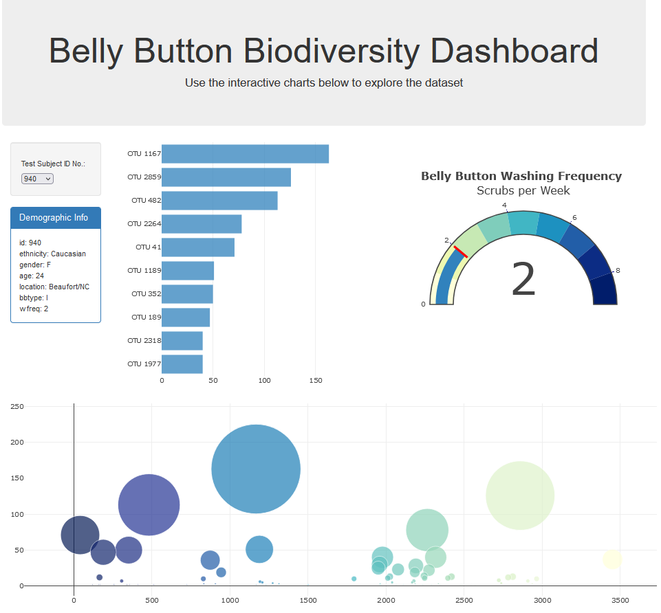

# Belly Button Challenge
### Contributor: "Alice" Lan Nguyen
### Overview: 
In this project, I build an interactive dashboard from the Belly Button Biodiversity dataset. The dashboard displays the microbes that colonize human navels. The dashboard feature a dropdown menu that includes all the test subjects, a demographic information table of the subject. It also includes a horizontal bar chart that shows the top 10 OTUs found in that individual. On the right handside is a Gauge chart that display the weekly washing frequency of the individual. At the bottom of the page is a buble chart that display the biodiversity of each sample.

To interact with the dashboard, please use this link: https://lannguyen135.github.io/belly-button-challenge/

### static\js\app.js

init function: 
- use the D3 library to read in the data from the url https://2u-data-curriculum-team.s3.amazonaws.com/dataviz-classroom/v1.1/14-Interactive-Web-Visualizations/02-Homework/samples.json
- add test subject id number to the drop down list
- set up data of the default test subject (which is also the first test subject)
- set up the default charts using information from previous step and barChart, bubbleChart, metadataTable and gaugeChart functions defined below,

optionChanged function:
When user choose a different test subject, this function find that subject's information and update the existing table and charts.

barChart function: 
This function takes in test subject information and turns them into a bar chart on the dashboard.

bubbleChart function:
This function takes in test subject information and turns them into a buble chart on the dashboard.

metadataTable function:
This function takes in test subject information and puts them into the Demographic Info table.

gaugeChart function:
This function takes in test subject information and turns them into the gauge chart.

This is how the dashboard look like: 

### Credit:
- Instructor: Hunter Hollis
- https://github.com/dmcneill0711/Digging-Into-The-Belly-Button-Biome/tree/main
- https://plotly.com/javascript/gauge-charts/
- https://loading.io/color/feature/YlGnBu-8/
